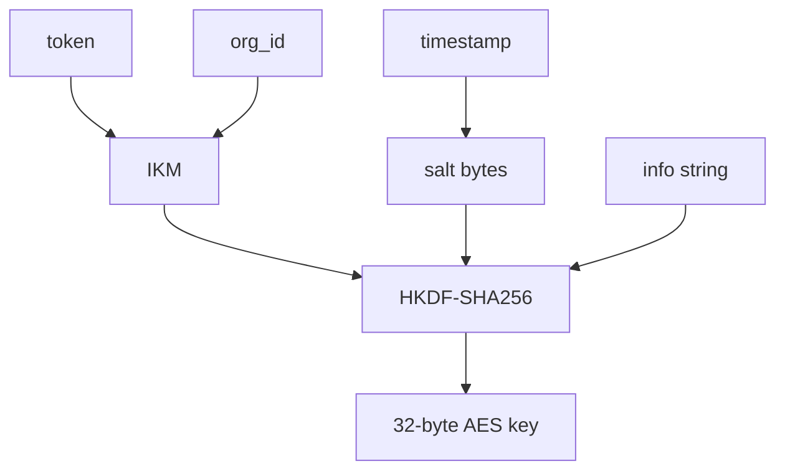

# Key Derivation

> Built by **@kaushik mangukiya**  
> Found a bug or have feedback? → kaushikmangukiya360@gmail.com

chronovault key derivation uses HKDF-SHA256 with per-second salt.

```python
from chronovault.core.kde import derive_key

key = derive_key(tenant_token="token", org_id="acme", timestamp=1710000000)
print(len(key))  # 32
```

Inputs:

- IKM: `f"{org_id}:{tenant_token}"`
- Salt: `timestamp.to_bytes(8, "big")`
- Info: `f"chronovault-v1:{org_id}:{timestamp}"`



Why it matters:

- Tenant separation through `org_id`.
- Temporal separation through timestamp salt.
- Domain separation through info string.

---
<div align="center">

**chronovault** — Enterprise Encrypted JSON Database for Python

Built with love by [@kaushik mangukiya](https://github.com/kaushikmangukiya)  
Bug reports & feedback → kaushikmangukiya360@gmail.com

</div>
