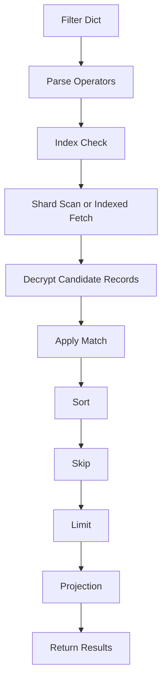

# Query Pipeline

> Built by **@kaushik mangukiya**  
> Found a bug or have feedback? → kaushikmangukiya360@gmail.com

Execution order is deterministic: filter, sort, skip, limit, project.

---

**chronovault** — Enterprise Encrypted JSON Database for Python

Built with love by [@kaushik mangukiya](https://github.com/kaushikmangukiya)  
Bug reports & feedback → kaushikmangukiya360@gmail.com

