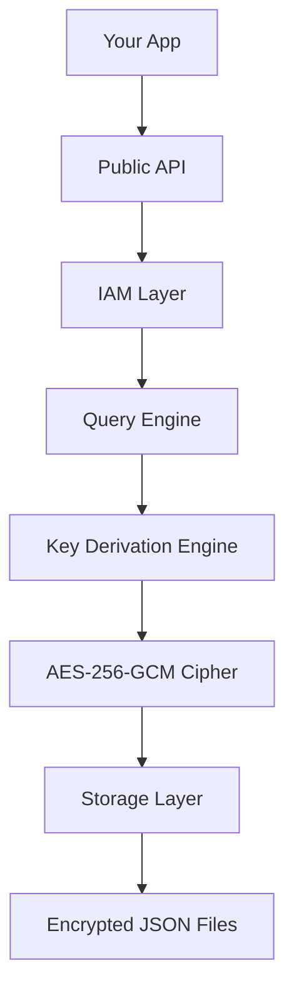
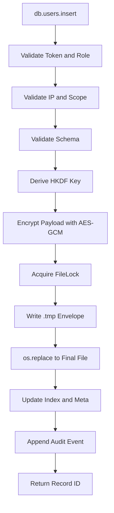
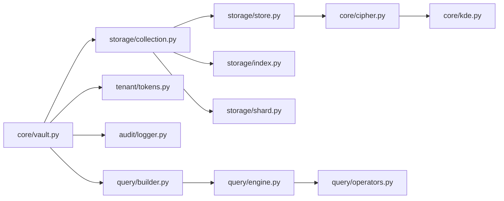

# System Architecture

> Built by **@kaushik mangukiya**  
> Found a bug or have feedback? → kaushikmangukiya360@gmail.com

## Table of Contents

- Layered Architecture Diagram
- Request Lifecycle Diagram
- Component Dependency Map
- Layer Walkthrough

## Layered Architecture Diagram

## Request Lifecycle Diagram

## Component Map

## Layer Walkthrough

### Public API Layer

`connect()` initializes the vault context, provisions tenant structure if missing, and validates access token state. Collection access is proxy-based (`db.users`) and delegates to collection operations with IAM checks.

### IAM Layer

Token validation covers hash lookup, revocation status, expiry, IP allowlist, and collection scoping. RBAC gates each action.

### Query Layer

The query engine handles operator matching and transforms results through sort/pagination/projection. Builder chaining keeps callsites readable and deterministic.

### Cryptography Layer

HKDF derives a 32-byte key from token + org + epoch. Cipher layer uses AES-256-GCM with random nonce and integrity tag.

### Storage Layer

Writes are lock-protected, atomic (`.tmp` then `os.replace`), and permission tightened to owner-only. Data is partitioned into shards and can be scanned in parallel.

### Persistence Layer

All persisted artifacts are JSON files with encrypted payload envelopes.

---

**chronovault** — Enterprise Encrypted JSON Database for Python

Built with love by [@kaushik mangukiya](https://github.com/kaushikmangukiya360)  
Bug reports & feedback → kaushikmangukiya360@gmail.com

