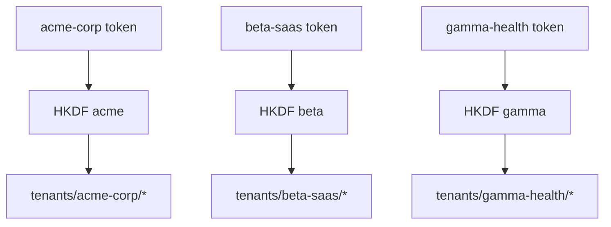

# Tenant Isolation

> Built by **@kaushik mangukiya**  
> Found a bug or have feedback? → kaushikmangukiya360@gmail.com

Tenant boundaries are implemented by directory namespaces and cryptographic derivation context.

Cross-tenant decryption fails because `org_id` changes derivation output even with similar token structure.

---

**chronovault** — Enterprise Encrypted JSON Database for Python

Built with love by [@kaushik mangukiya](https://github.com/kaushikmangukiya)  
Bug reports & feedback → kaushikmangukiya360@gmail.com

