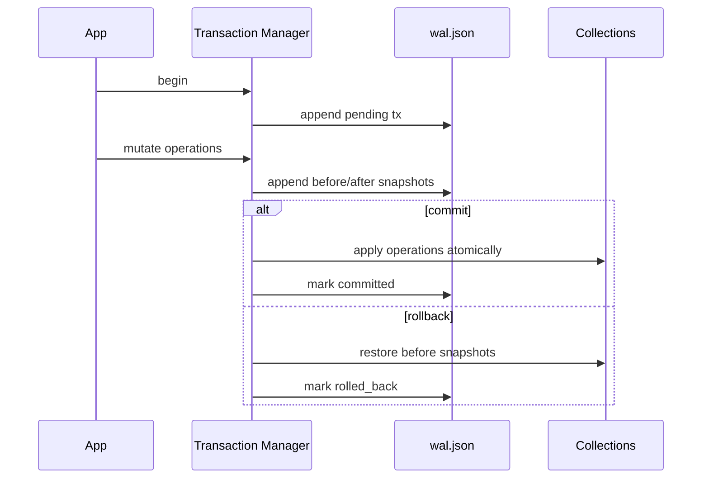

# Transaction Internals

> Built by **@kaushik mangukiya**  
> Found a bug or have feedback? → kaushikmangukiya360@gmail.com

Transactions use an encrypted write-ahead log (`wal.json`) with operation snapshots.

Startup recovery checks pending entries and completes rollback/commit based on WAL state policy.

---

**chronovault** — Enterprise Encrypted JSON Database for Python

Built with love by [@kaushik mangukiya](https://github.com/kaushikmangukiya)  
Bug reports & feedback → kaushikmangukiya360@gmail.com

